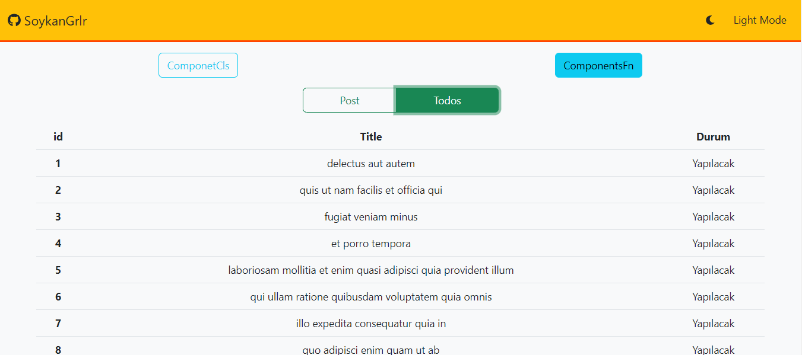

# Homework 3

- Todo ve post olarak fetch ile 2 adet data çekilerek bunlar class component ve Fn componentde ayrı ayrı render edildi.
- Bir tane hook yazıldı(useContext kullanıldı), bu context tema bilgisini tutacak aynı zamanda birden fazla componentte kullanılabilecek.İki adet buton yardımı ile dark/light tema geçisi sağlansın ve görünüm sağlandıktan sonra contextin değeri ne ise sayfada yazdırıldı.

